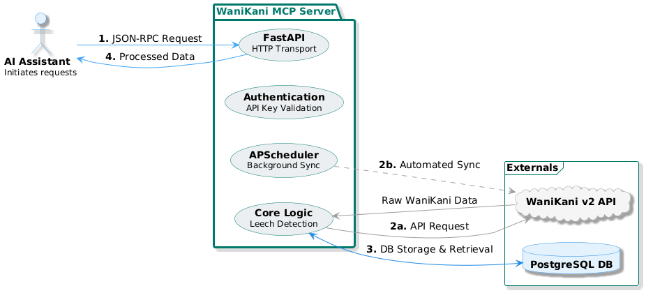

# WaniKani MCP Server

## 🌟 Empowering AI Assistants with WaniKani Data 🌟

The WaniKani MCP (Model Context Protocol) Server is a robust backend service designed to provide AI assistants with seamless, real-time access to WaniKani user data and functionality. By implementing the MCP specification over JSON-RPC via HTTP, this server enables AI assistants to:

*   **Retrieve User Progress**: Get up-to-date information on WaniKani levels, available lessons, and upcoming reviews.
*   **Trigger Data Synchronization**: Manually initiate data syncs with the official WaniKani v2 API to ensure fresh data.
*   **Identify Problematic Items (Leeches)**: Leverage advanced algorithms to pinpoint consistently challenging items for targeted learning.
*   **Offer Personalized Learning Assistance**: Empower AI to provide tailored support based on individual user data.

---

## 🚀 Key Features

*   **Automated Data Synchronization**: Keeps user data fresh and up-to-date by periodically syncing with the official WaniKani v2 API.
*   **Real-time Progress & Status**: Provides AI assistants with instant access to a user's current WaniKani level, available lessons, upcoming reviews, and next review times.
*   **Intelligent Leech Identification**: Utilizes an advanced algorithm to analyze review history and pinpoint consistently problematic items ("leeches"), enabling targeted learning strategies.
*   **Multi-User Support**: Securely manages data for multiple users through API key-based authentication, ensuring personalized and private access.

---

## 🏗️ Architecture Overview

The server is built with a focus on modularity and scalability, leveraging modern Python technologies.



---

## 🛠️ Getting Started

This guide will help you set up and run the WaniKani MCP Server locally.

### Prerequisites

*   Python 3.9+
*   `uv` (recommended package manager)
*   PostgreSQL database

### Installation

1.  **Clone the repository:**
    ```bash
    git clone https://github.com/jackedney/wanikani-mcp.git
    cd wanikani-mcp
    ```

2.  **Install dependencies using `uv`:**
    ```bash
    uv install
    ```

3.  **Configure Environment Variables:**
    Create a `.env` file in the root directory based on `.env.example` (if available) and fill in your PostgreSQL connection string and WaniKani API key.
    *   **Note**: `.env.example` is currently under construction and may not be available yet.

4.  **Run Database Migrations:**
    ```bash
    uv run alembic upgrade head
    ```

### Usage

To start the development server:

```bash
task dev
```
*   **Note**: The `task dev` command is currently under construction and may not be fully implemented yet. You might need to run the server directly via `uv run python src/wanikani_mcp/server.py` if `task dev` fails.

The server will typically run on `http://localhost:8000`. You can then interact with it using MCP-compliant AI assistants or by sending JSON-RPC requests to its endpoints.

### Core MCP Tools

AI assistants can leverage the following tools:

*   **`get_status`**: Obtain a snapshot of the user's current WaniKani learning status.
*   **`get_leeches`**: Identify and retrieve a list of the user's most challenging items.
*   **`sync_data`**: Manually initiate a data synchronization with WaniKani servers.

### Available MCP Resources

The server also exposes structured data resources:

*   **`user_progress`**: Comprehensive statistics and progress details for a user.
*   **`review_forecast`**: A timeline of upcoming reviews.
*   **`item_database`**: A searchable collection of all WaniKani items relevant to the user.

---

## 🧑‍💻 Development

For contributors and developers:

*   **Run Linter/Formatter**: 
    ```bash
    uv run ruff check .
    uv run ruff format .
    ```
*   **Run Type Checker**: 
    ```bash
    uvx ty check .
    ```
*   **Run Tests**: 
    ```bash
    uv run pytest
    ```
